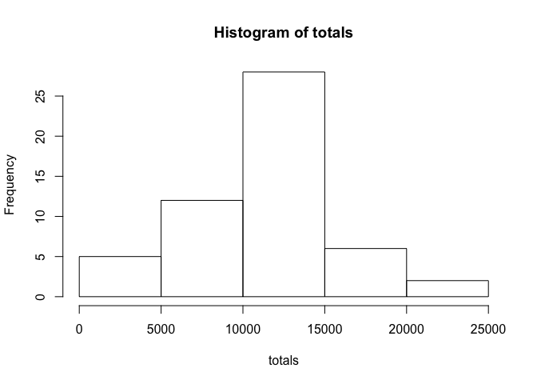
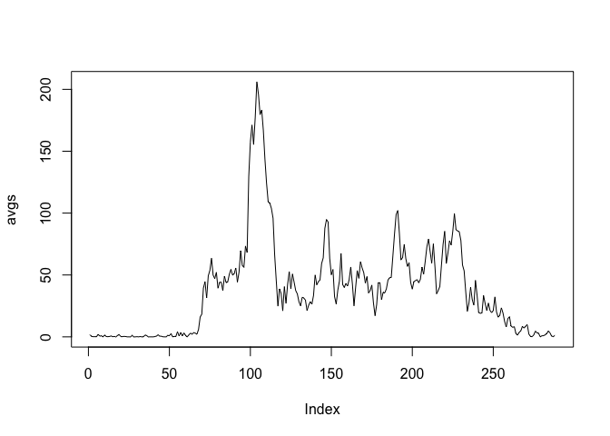
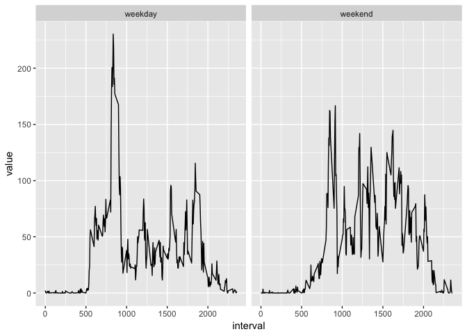

# Reproducible Research: Peer Assessment 1


## Loading and preprocessing the data
First, we load the data.


```r
unzip("activity.zip")
data <- read.csv("activity.csv")
data$date <- as.Date(data$date)
```

## What is mean total number of steps taken per day?

The total number of steps taken each day can be seen in the following plot

```r
totals <- tapply(data$steps,data$date,sum)
hist(totals)
```

<!-- -->
As seen by the following code, the mean and median number of steps taken each day are 10766 and 10765, respectively.


```r
mean(totals,na.rm = TRUE)
```

```
## [1] 10766.19
```

```r
median(totals,na.rm = TRUE)
```

```
## [1] 10765
```

## What is the average daily activity pattern?

Averaging across days for each 5-minute interval produces the daily activity pattern.


```r
avgs <- tapply(data$steps,data$interval,mean,na.rm=TRUE)
plot(avgs, type="l")
```

<!-- -->

On average, interval numbered 835 contains the most steps at 206.


```r
which.max(avgs)
```

```
## 835 
## 104
```

```r
avgs[104]
```

```
##      835 
## 206.1698
```

## Imputing missing values
The data contains 2304 missing values.


```r
sum(is.na(data$steps))
```

```
## [1] 2304
```
We use the mean for each 5-minute interval to replace missing values


```r
library(dplyr)
```

```
## 
## Attaching package: 'dplyr'
```

```
## The following objects are masked from 'package:stats':
## 
##     filter, lag
```

```
## The following objects are masked from 'package:base':
## 
##     intersect, setdiff, setequal, union
```

```r
m <- merge(data,avgs,by.x="interval",by.y = "row.names")
noNAs <- m %>% mutate(steps = ifelse(is.na(steps),y,steps)) %>% select(steps,date,interval)
```

The mean and median are now both 10766. The mean and median remain almost unchanged from what we calculated previously. This is most likely because we of the method wee used to replace the missing values; that is, to replace them by the average of the 5-minute intervals.


```r
totals_noNAs <- tapply(noNAs$steps, noNAs$date,sum)
mean(totals_noNAs)
```

```
## [1] 10766.19
```

```r
median(totals_noNAs)
```

```
## [1] 10766.19
```

## Are there differences in activity patterns between weekdays and weekends?

We create a factor variable "weekend" or "weekday" depending on the day of the week and then calculate the mean across all weekday days or weekend days.

```r
weekday_or_end <- function(d) {
dow = weekdays(d)
if(dow == "Saturday" | dow == "Sunday")
  factor("weekend")
else if(dow == "Monday" | dow == "Tuesday" | dow == "Wednesday" | dow == "Thursday" | dow == "Friday")
  factor("weekday")
else
  NA
}

noNAs$dayOfWeek = sapply(noNAs$date,weekday_or_end)
totalsByDayType <- tapply(noNAs$steps,noNAs[c("interval", "dayOfWeek")],mean)
```

Weekday and weekend activity patterns can be compared side-by-side in a two-panel plot.


```r
library(ggplot2)
library(reshape2)
z <- melt(totalsByDayType)
qplot(interval,value,data=z, facets=.~dayOfWeek, geom="line")
```

<!-- -->

The plot shows that the person is generally more active on the weekends than weekdays. The hours that they are active on weekends are shifted slightly later in the day compared to weekdays. The most active point occurs for the person on weekdays. This has a number of potential explanations: the person walks to get to work or eat a meal, or maybe they exercise before going to work.

